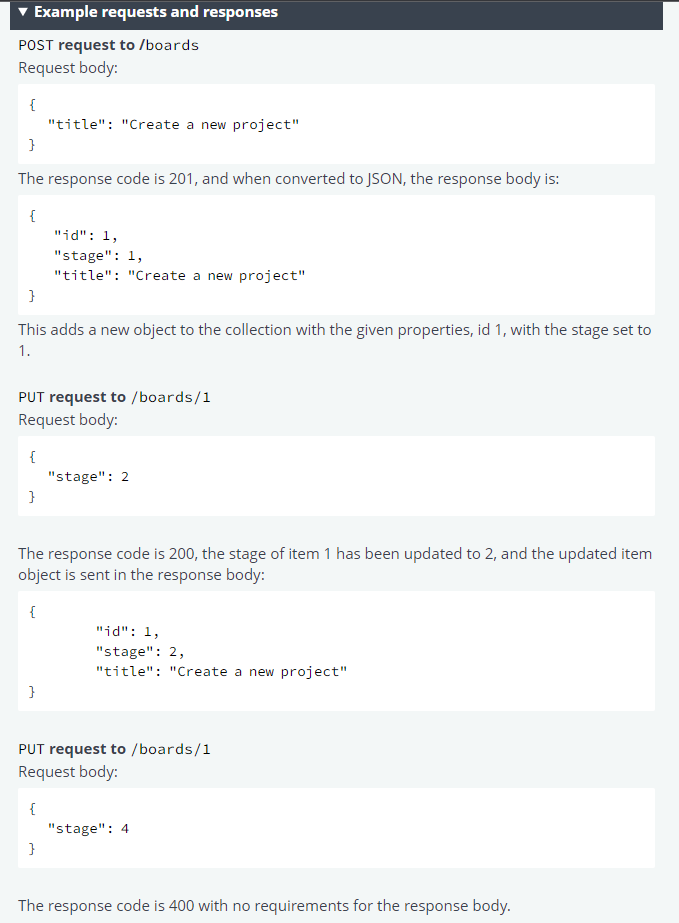

# Kanban Board API

## Data:

Example of a repo data JSON object:

```
{
    "title": "Create a new project"
}
```

## Project Specifications:

The model implementation is provided and read-only.

The task is to implement the REST service that exposes the /boards endpoint, which allows for managing the collection of items in a Kanban Board and current stage in the following way:

- POST request to `/boards`:

  - creates a new item in the board
  - expects a JSON item object without the id and stage property as the body payload. You can assume that the given object is always valid.
  - adds the given  object containing the item to the board and assigns a unique integer id to it. The first created item must have id 1, the second one 2, and so on.
  - each newly created item should have the stage 1
  - you can assume that the stage property will never be passed
  - the response code is 201, and the response body is the created kanban board item object
  - the stage of an item in the board is a number, each of which is detailed as follows:

  ```text
       * 1: TODO
       * 2: In Progress
       * 3: Completed
  ```

- PUT request to `/boards/:id`
  - accepts the stage property containing the new stage as the body payload
  - updates the stage of the item for passed item id
  - if the stage value passed is not one of 1,2,3, return with the status code 400 with no requirement on the response body
  - the response code is 200, with the updated item as the response body
  - you can assume that the passed item ID always exists

You should complete the given project so that it passes all the test cases when running the provided unit tests. The project by default supports the use of the SQLite3 database.

## Respuestas esperadas por HackerRank



## Environment

- Node Version: v12 (LTS)
- Default Port: 8000

**Read Only Files**

- `test/*`

**Commands**

- run:

```bash
bash bin/env_setup && . $HOME/.nvm/nvm.sh && npm start
```

- install:

```bash
bash bin/env_setup && . $HOME/.nvm/nvm.sh && npm install
```

- test:

```bash
bash bin/env_setup && . $HOME/.nvm/nvm.sh && npm test
```


